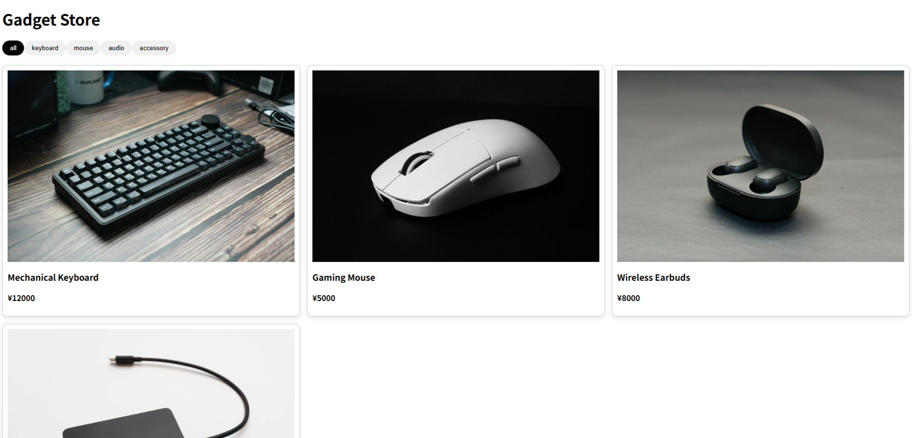

# Gadget-Store-UI

## Demo

## 概要
JavaScriptで作成したガジェットストアのUIです。
カテゴリフィルター・検索・並び替え機能を組み合わせて、商品を動的に表示できます。

## 機能
- カテゴリフィルター
- 動的な商品表示（JavaScript）
- アクティブボタン表示
- 並び替え（安い順/高い順）
- 件数表示
- 該当無し時のメッセージ表示
- キーワード検索

## 使用技術
- HTML
- CSS
- JavaScript

## 工夫した点
- 見やすいカードデザイン
- シンプルで使いやすいUI
- フィルター・検索・並び替えを同時に適用できるようにした
- UIの状態（activeクラス）を適切に切り替えるようにした
- currentCategory/currentKeyword/currentSortで状態管理を分離した
- 配列のコピー（スプレッド構文）と参照の違いを意識して実装した

## 今後の改善
- カート機能の追加
- デザインのブラッシュアップ

## 制作背景
JavaScriptの配列操作やDOM操作の理解を深めるために制作しました。
